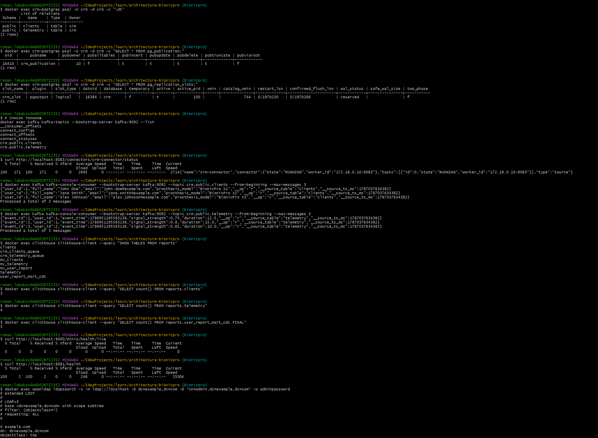
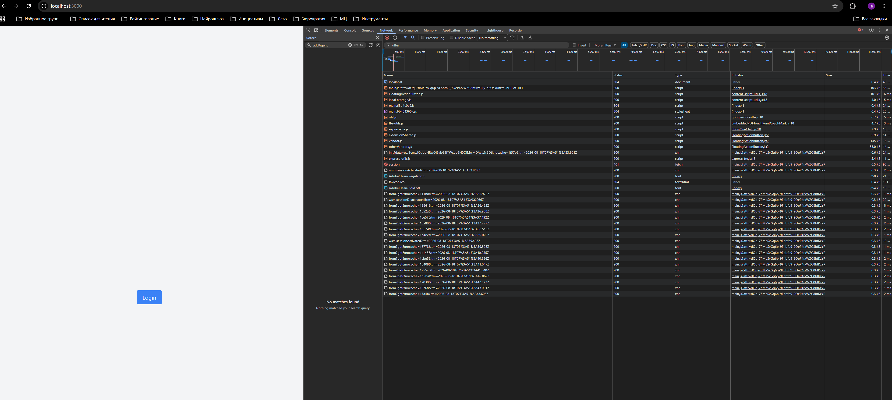
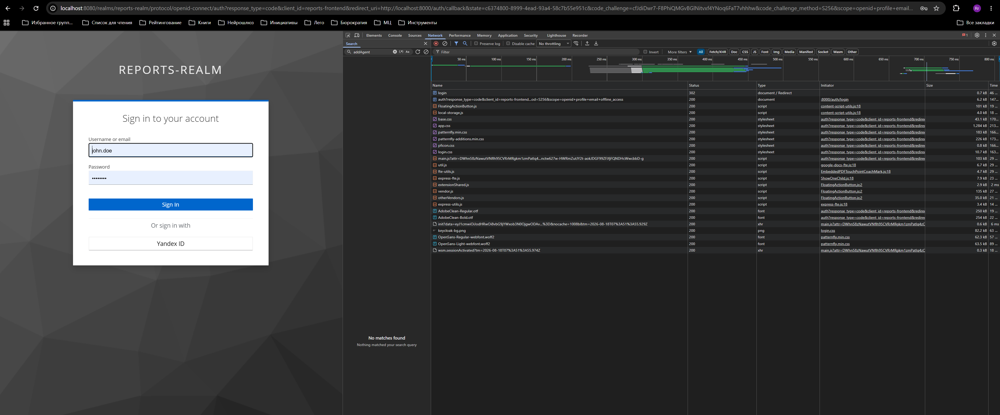
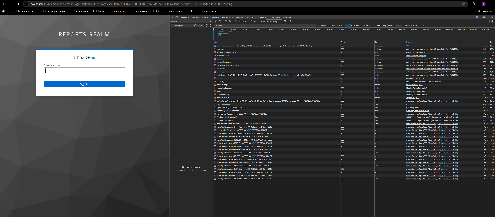
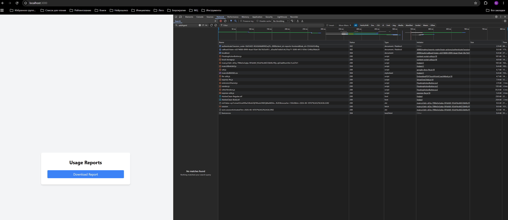
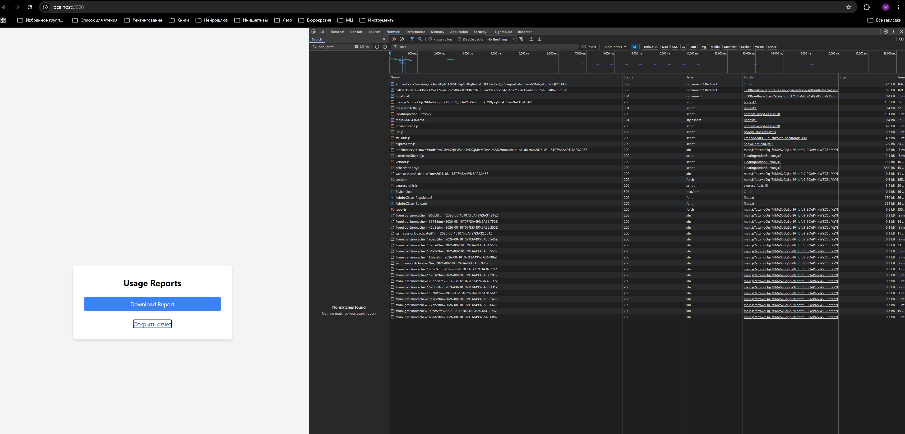
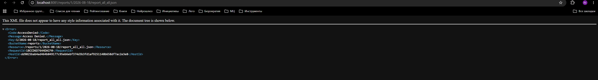

# Спринт 9

- Исходные файлы перенесены в source/
- В корне лежит docker-compose общий для всего проекта
- docker-compose в корне запускает последние версии приложений и использует последние версии настроек кейклока и прочего
- коннектор debezium устанавливается автоматически
- скрипты для инициализации бд postgres + clickhouse лежат в новой папке init
- В папках Task1-4 и подпапках вида subtask* лежат результаты заданий в хронологическом порядке

После запуска docker-compose и после старта всех сервисов, можно зайти в http://localhost:3000 авторизоваться как john.doe
с паролем password, добавить двухфакторку и скачать отчет.

